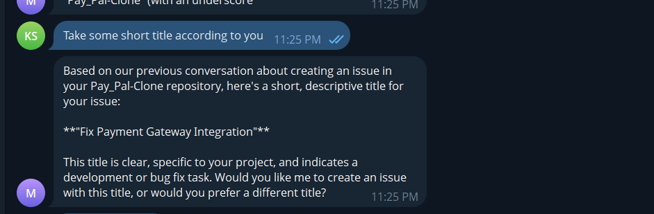

# MiniBot - AI Assistant with RAG Memory

A mini version of ClawBot/MoltBot with RAG-based memory storage, multi-layered memory, messaging platform integration, and support for both commercial and open-source AI models.

## 🚀 Features

- **Multi-layered Memory System**
  - Short-term memory (in-memory)
  - Long-term memory (persistent storage)
  - RAG-based memory with embeddings

- **AI Model Support**
  - 🆓 **Open Source Models**: Llama 3.1, Mistral, Phi3, Gemma, CodeLlama, Qwen2
  - 💰 **Commercial Models**: GPT-4, GPT-3.5, Claude 3 Sonnet/Haiku
  - Runtime model switching per user

- **Messaging Platform Integration**
  - Telegram Bot API integration
  - WhatsApp integration support

- **MCP Integration**
  - GitHub MCP for repository operations
  - Figma MCP for design operations

- **Thought-Action-Output Chain**
  - Structured reasoning process
  - Detailed response generation

- **API Integration**
  - Multiple AI provider support (OpenAI, Anthropic, Gemini, Ollama)
  - Flexible model switching
  - Easy scaling and management

## 🏗️ Architecture

```
├── src/
│   ├── core/           # Core AI logic
│   ├── memory/         # Memory management
│   ├── messaging/      # Platform integrations
│   ├── mcp/           # MCP integrations
│   └── utils/         # Utilities
├── config/            # Configuration files
└── data/             # Data storage
```

## 🚀 Quick Start with API Keys (Recommended)

### Prerequisites
- Node.js 18+
- API keys for your preferred AI providers
- 2GB+ RAM

### 1. Setup with Docker
### 1. Setup
```bash
# Clone the repository
git clone <repository-url>
cd minibot-ai

# Install dependencies
npm install

# Run setup script
node setup.js
```

### 2. Configure Environment
Edit `.env` file with your API keys:
```env
# AI Models - Add your preferred provider keys
OPENAI_API_KEY=your_openai_api_key
ANTHROPIC_API_KEY=your_anthropic_api_key
GEMINI_API_KEY=your_gemini_api_key
OLLAMA_API_KEY=your_ollama_api_key
DEFAULT_MODEL=ministral-3-3b

# Required for messaging
TELEGRAM_BOT_TOKEN=your_telegram_bot_token

# Optional: MCP integrations
GITHUB_TOKEN=your_github_token
FIGMA_TOKEN=your_figma_token
```

### 3. Start the Application
```bash
npm start
```

### 4. Test the Bot
```bash
curl http://localhost:3000/health
```

## 💻 Alternative: Local Development Setup

### 1. Prerequisites
- Node.js 18+
- npm or yarn

### 2. Install Ollama
```bash
# On Linux/Mac
curl -fsSL https://ollama.ai/install.sh | sh

# On Windows
# Download from https://ollama.ai/download
```

### 3. Setup Project
```bash
node setup.js
npm install
```

### 4. Start Development
```bash
npm run dev
```

## 🤖 Available AI Models

### 🔥 Ollama Cloud Models (API-based)
- **deepseek-v3.2** - Advanced reasoning model (default)
- **gpt-oss-120b** - Large open-source GPT model
- **qwen3-coder** - Specialized coding model
- **mistral-large-3** - Latest Mistral model
- **kimi-k2.5** - Advanced reasoning model
- **ministral-3** - Lightweight Mistral variants (3B, 8B, 14B)
- **gemma3** - Google's Gemma 3 models (4B, 12B, 27B)

### 💰 Commercial Models (API Key Required)
- **gpt-4** - OpenAI's GPT-4
- **gpt-3.5-turbo** - OpenAI's GPT-3.5 Turbo
- **claude-3-sonnet** - Anthropic's Claude 3 Sonnet
- **claude-3-haiku** - Anthropic's Claude 3 Haiku

## 📱 Platform Setup

### Telegram Bot Setup
1. Message @BotFather on Telegram
2. Create a new bot with `/newbot`
3. Copy the token to `TELEGRAM_BOT_TOKEN` in `.env`

### WhatsApp Setup
1. Start the application
2. Scan QR code with WhatsApp mobile app
3. Session will be saved for future use

### GitHub Integration
1. Go to GitHub Settings → Developer settings → Personal access tokens
2. Generate token with `repo` and `read:user` permissions
3. Add to `GITHUB_TOKEN` in `.env`

### Figma Integration
1. Go to Figma Settings → Account → Personal access tokens
2. Generate new token
3. Add to `FIGMA_TOKEN` in `.env`

## 📊 Usage Examples

### Chat Commands
```
/start - Start the bot
/help - Show help message
/model list - Show available models
/model ministral-3-3b - Switch to Ministral 3B
/model info gpt-4 - Get model information
/status - Show bot status
/memory stats - Show memory statistics
/clear - Clear conversation history
```

### Model Switching
```
User: /model list
Bot: 🤖 Available AI Models:

🔥 Ollama Cloud Models:
✅ ministral-3-3b
✅ deepseek-v3.2
✅ gpt-oss-120b

💰 Commercial Models:
⚪ gpt-4
⚪ claude-3-sonnet

User: /model mistral
Bot: ✅ AI model changed to: 🆓 mistral
```

## 📱 Demo Screenshots

### Bot Status and Model Information
The bot provides comprehensive status information including current AI model, memory statistics, and available models:


*Shows the bot running with DeepSeek V3.2 model, displaying memory statistics (4 short-term items, 22 long-term memories, 1 RAG document) and listing all available AI models including both Ollama Cloud and commercial options.*

### GitHub Integration Demo
MiniBot can interact with GitHub repositories, create issues, and provide intelligent suggestions:



*Demonstrates the bot's ability to understand project context and suggest appropriate GitHub issue titles like "Fix Payment Gateway Integration" based on conversation history.*

> **Note**: To add your actual demo screenshots, replace the placeholder files in the `demos/` folder with your Telegram screenshots. The images should show the bot's key features in action.

### Key Demo Features Shown:
- **🧠 AI Model**: DeepSeek V3.2 for fast, accurate responses
- **💾 Memory System**: Multi-layered memory with short-term, long-term, and RAG storage
- **🔗 MCP Integration**: 2 active MCP servers (GitHub and Figma)
- **📊 Model Variety**: 19+ available AI models including GPT-4, Claude, Gemini, and Ollama models
- **🤖 Smart Responses**: Context-aware suggestions and intelligent conversation handling
- **⚡ Real-time Status**: Live memory statistics and system status monitoring

## 🚀 Deployment

### Docker Production Deployment
```bash
# Production deployment
docker-compose -f docker-compose.yml -f docker-compose.prod.yml up -d

# With SSL/HTTPS
## 🚀 Deployment

### Cloud Deployment
- **Heroku**: Simple deployment with buildpacks
- **Railway**: One-click deployment from GitHub
- **DigitalOcean App Platform**: Managed container deployment
- **AWS**: Use EC2 or Lambda with the Node.js runtime
- **Google Cloud**: Deploy to Cloud Run or Compute Engine
- **Azure**: Use App Service or Container Instances

## 🔒 Security Features

- **API Key Management**: Secure storage of API credentials
- **Rate Limiting**: Built-in request throttling
- **Input Validation**: Comprehensive input sanitization
- **User Data Isolation**: Per-user memory and session management
- **Secure Defaults**: Environment-based configuration

## 📈 Monitoring

### Health Checks
```bash
# Check application health
curl http://localhost:3000/health

# Check status endpoint
curl http://localhost:3000/status

# View logs
npm run dev  # Development with live logs
tail -f logs/combined.log  # Production logs
```

### Performance Monitoring
```bash
# Check resource usage
docker stats

# Monitor memory usage
curl http://localhost:3000/status | jq '.memory'
```

## 🛠️ Development

### Adding New Models
1. Update `availableModels` in `src/core/AIModelManager.js`
2. Implement provider-specific generation method
3. Add API key to `.env` file if needed

### Custom MCP Servers
1. Create new MCP class in `src/mcp/`
2. Register in `MCPManager.js`
3. Add configuration to `config/mcp.json`

## 🤝 Contributing

1. Fork the repository
2. Create a feature branch
3. Make your changes
4. Add tests if applicable
5. Submit a pull request

## 📄 License

MIT License - see LICENSE file for details

## 🆘 Support

- **Documentation**: See `ARCHITECTURE.md` and `DEPLOYMENT.md`
- **Issues**: Create GitHub issues for bugs or feature requests
- **Discussions**: Use GitHub Discussions for questions

## 🙏 Acknowledgments

- Ollama team for the excellent local LLM server
- Hugging Face for the transformers library
- OpenAI and Anthropic for their APIs
- The open-source AI community